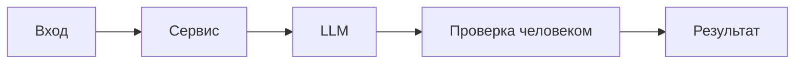

# ADR: решение для первого рабочего сценария

- Статус: proposed / accepted
- Дата: 2026-09-20
- Ответственные: команда ревью-помощника

## Контекст

TRAINING_PR.diff показывает минимальный FastAPI-сервис и ReviewService, который напрямую отправляет diff во внешний LLM и возвращает строку в поле comment, без валидации и соблюдения правил CASE.md.
## Решение

Добавить слой адаптера: валидация payload, лимит длины diff (413), редактирование секретов (SEC-1), вызов LLM с таймаутом 10с (REL-1), нормализация ответа под OUT-1, логирование только метаданных (OBS-1).
## Рассмотренные альтернативы

| Альтернатива | Почему не выбрали сейчас |
|---|---|
| Делать всю логику в LLM | Непредсказуемость и отсутствие гарантий по SEC/API/OUT |
| Принимать любые размеры diff | Риск 413 у LLM/модели и деградация производительности |
| Синхронный долгий вызов без таймаутов | Подвешивает API и ухудшает UX |

## Последствия и главный риск

- Положительные последствия:
- Ограничения:
- Главный риск:
- Как проверим риск:
  - Положительные: соблюдение SEC/API/REL/OUT, предсказуемость и интегрируемость.
  - Ограничения: дополнительная сложность адаптера, необходимость поддерживать список паттернов секретов.
  - Главный риск: неполное редактирование секретов и ложные срабатывания.
  - Проверка: e2e с синтетическими секретами и аудит шаблонов.

## Архитектурная схема

## Как использовали AI

- Для чего:
- Тип промпта:
- Строка в [`prompts.md`](prompts.md):
- Что проверили и исправили сами:
