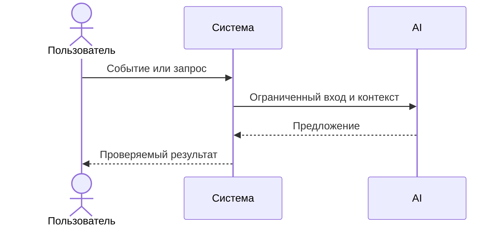

# Use cases и user stories

## Первый рабочий сценарий

**Когда** разработчик отправляет дифф PR в сервис, **система** валидирует и редактирует секреты, вызывает LLM и нормализует ответ, **а пользователь получает** краткое summary, ≤3 подтверждённых риска и список проверок.

Не входит в этот сценарий:

- Авто-мерж/аппрув PR, исправление кода, интеграции с GitHub Actions.

## Use case

| Поле | Значение |
|---|---|
| Актор | Ревьюер/CI |
| Триггер | POST /api/reviews с diff |
| Предусловия | Доступ к API, diff ≤ 20 000 символов |
| Основной результат | JSON по OUT-1 |
| Ошибка или отказ | 413 на больших диффах; контролируемый ответ при таймауте |



## User stories и acceptance criteria

```gherkin
Feature:

  Scenario: Позитивный
    Given валидный diff без секретов, размером < 20k символов
    When отправляем POST /api/reviews
    Then получаем JSON с полями summary, risks (≤3) и checks

  Scenario: Негативный или граничный
    Given diff содержит строки вида token=123 и приватные ключи
    When отправляем POST /api/reviews
    Then в prompt/логах нет секретов, а в ответе присутствует проверка редактирования
```

## Как использовали AI

- Для чего: описать пользовательскую ценность и границы сценария
- Тип промпта: master prompt
- Строка в [`prompts.md`](prompts.md): P1-02
- Что проверили и исправили сами: уточнили критерии приемки под CASE.md
