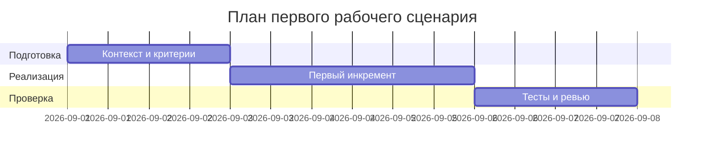

# План поставки

## Инкременты и ответственность

| Инкремент | Наблюдаемый результат | Что делает человек | Что делает AI или субагент | Проверка | Зависимости |
|---|---|---|---|---|---|
| 1 | Слой валидации входа и 413 | Проектирует схему | Подсказывает JSONSchema | Интеграционный тест 413 | CASE.md API-1 |
| 2 | Редактирование секретов | Утверждает паттерны | Предлагает regex | Юнит тесты редактирования | CASE.md SEC-1 |
| 3 | Таймаут и контролируемый ответ | Ставит SLA | Добавляет обработку таймаута | Интеграционный тест таймаута | CASE.md REL-1 |

## Диаграмма Ганта

Замените даты и задачи на свой план.

## Как использовали AI

- Для чего: декомпозировать поставку первого сценария
- Тип промпта: master prompt
- Строка в [`prompts.md`](prompts.md): P1-02
- Что проверили и исправили сами: соотнесли проверки с правилами CASE.md
